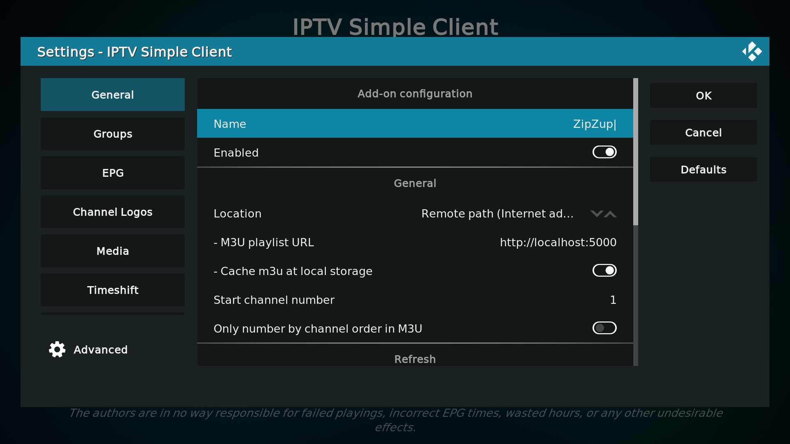
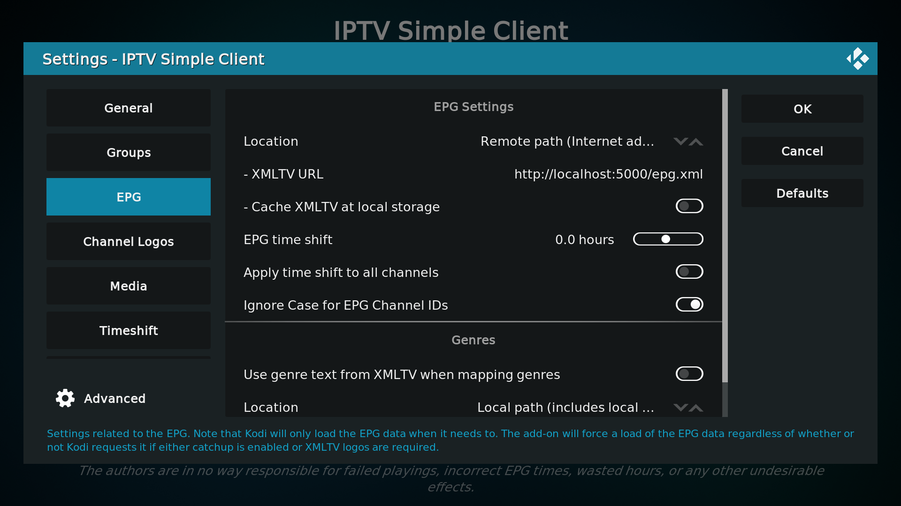
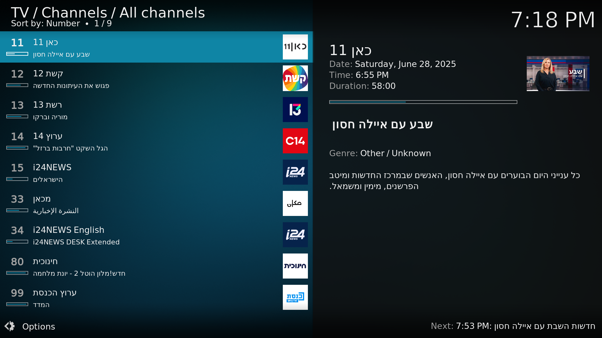
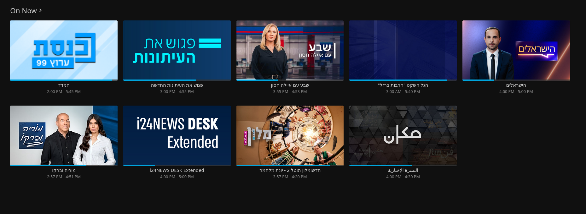

# ZipZup
### לזפזופ ולתפאָרת
M3U Tuner (with XMLTV guide) for Israeli TV channels with websites
## Why I made this
I wanted to integrate the news channels I watch into apps that I use ([Kodi](https://kodi.tv), [Jellyfin](https://jellyfin.org/), [NextPVR](https://nextpvr.com/), [VLC](https://www.videolan.org/vlc/)). I have no desire to download each and every channel's app to my phone/computer/TV.

Note the existence of [the idanplus plugin for Kodi](https://github.com/Fishenzon/repo/tree/master/zips/plugin.video.idanplus). I found it would freeze on certain channels and of course it only works on Kodi.

M3U IPTV is so widely supported that I believe you could stream it from a potato (though I have not tried).

## Setup (Docker Compose)
(If you haven't heard of docker or don't know how to use it I'm sure ChatGPT can help you)

You will need a machine to host the server. This can be your computer for example if that is the only device you will use to watch. Alternatively if you want to give constant access to your whole LAN you'll need a machine that's always on and connected to your LAN.

1. Install [Docker](https://www.docker.com/)
2. Make a new folder `zipzup`
3. Make a `docker-compose.yaml` file in `zipzup`
    ```yaml
    services:
        zipzup:
            image: ghcr.io/zipzup/zipzup:nightly
            ports:
            - "5000:5000"
            depends_on:
            - redis
            - selenium
            - postgresql
            environment:
            POSTGRES_USER: zipzup
            POSTGRES_PASSWORD: zipzup
            POSTGRES_DB: zipzup
            POSTGRES_HOST: postgresql

        redis:
            image: valkey/valkey:8.1.2-alpine3.22
        
        selenium:
            image: selenium/standalone-chromium

        postgresql:
            image: postgres:16-alpine
            environment:
            POSTGRES_USER: zipzup
            POSTGRES_PASSWORD: zipzup
            POSTGRES_DB: zipzup

            volumes:
            - postgres_data:/var/lib/postgresql/data

        guide-downloader:
            image: ghcr.io/zipzup/zipzup:nightly
            entrypoint: ["sh", "-c", "su abc -c 'python3 /app/epg_worker.py' && crond -f"]
            user: root
            environment:
            POSTGRES_USER: zipzup
            POSTGRES_PASSWORD: zipzup
            POSTGRES_DB: zipzup
            POSTGRES_HOST: postgresql

    volumes:
        postgres_data: {}
    ```

4. Run
    ```bash
    docker compose up -d
    ```
You should then be able to find the tuner at `http://localhost:5000` and the guide at `http://localhost:5000/epg.xml`.

## Access (Kodi)
1. Install [IPTV Simple Client](https://kodi.tv/addons/omega/pvr.iptvsimple/)
2. Go to the addon settings and click 'Edit "\<something in quotes\>"'
3. Under General, ensure M3U playlist URL is set to `http://localhost:5000` (or wherever your server is hosted):
4. Under EPG, ensure XMLTV URL is set to `http://localhost:5000/epg.xml`

5. Enjoy:


## Jellyfin (סנפיריבה)


## Final Notes
If someone wants to pay for a VPS to host this on the internet, let me know (through an issue or PR).